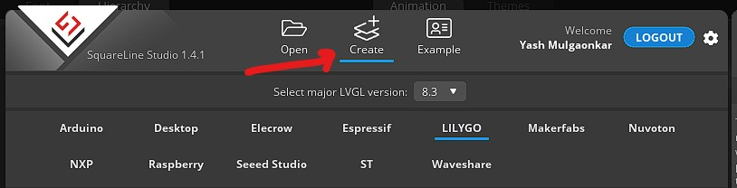
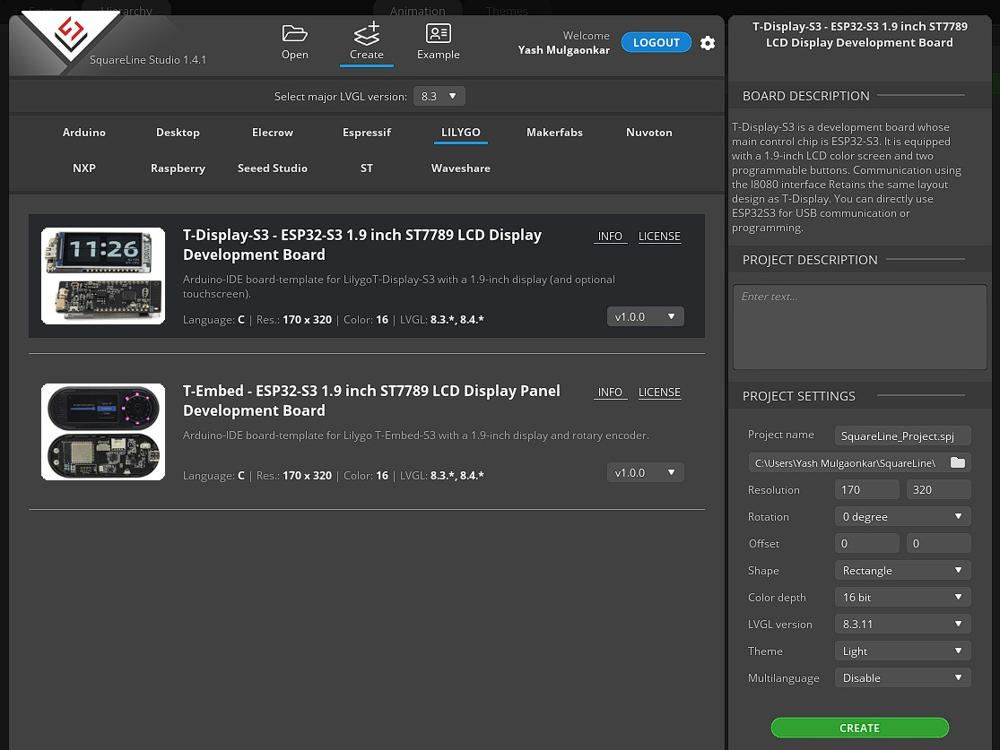
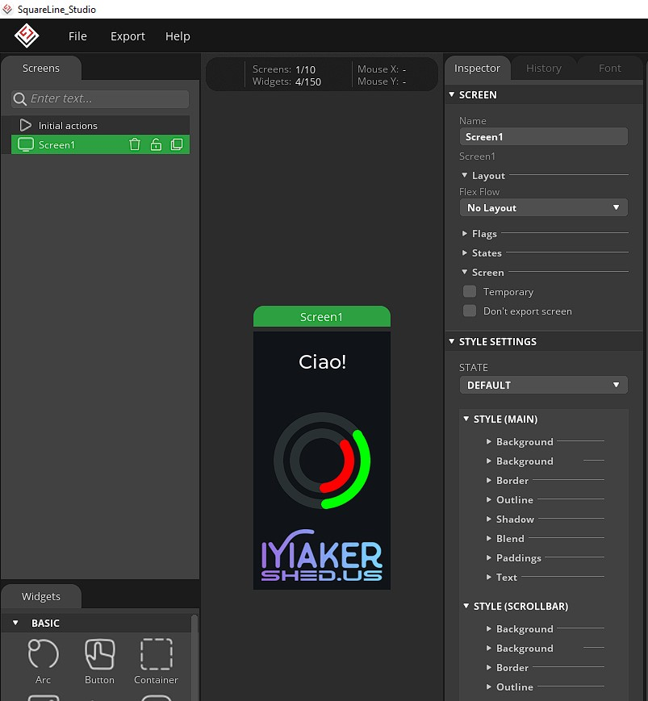

# SquareLine Studio Board Packages

Welcome to the **SquareLine Studio Board Packages** repository! This guide will help you set up and use the SquareLine Studio board packages for developing and deploying your applications.

## Table of Contents

- [Introduction](#introduction)
- [Requirements](#requirements)
- [Installation](#installation)
- [Usage](#usage)
  - [Setting Up Your Project](#setting-up-your-project)
  - [Flashing](#flashing)
- [Contribution Guidelines](#contribution-guidelines)
- [License](#license)

## Introduction

SquareLine Studio is a powerful development environment designed to help you create, build, and deploy GUIs for various hardware platforms. This repository contains board packages that enable support for different hardware configurations within SquareLine Studio.

The repository supports the following development boards:

| Board                                       | Processor  | Display Driver | Board Library |  LVGL Version  | Display Library / Version |
|---------------------------------------------|    :---:   |     :---:      |     :---:     |       :---:    |  :---:                    |
| Lilygo T-Display-S3                         | ESP32S3    |  ST7789V       |     2.0.17    |  8.3.11        |  TFT_eSPI - 2.5.43        |
| Lilygo T-Embed-S3                           | ESP32S3    |  ST7789        |     2.0.14    |  8.3.11        |  TFT_eSPI - 2.5.43        |
| Makerfabs Matouch 7in                       | ESP32S3    | RGB565         |     2.0.17    |  8.3.11        |  Arduino_GFX - 1.3.1      |
| Waveshare RP2040-LCD-1.28                   | RP2040     |  GC9A01A       | RP2040 - 3.2.2|  8.3.11        |  TFT_eSPI - 2.5.43        |
| Adafruit TFT Featherwing 3.5" + Feather V1  | ESP32      | HX8357D        |     2.0.17    |  8.3.11        |  TFT_eSPI - 2.5.43        |

## Requirements

Before you begin, ensure you have the following:

- SquareLine Studio installed on your computer.
- Supported hardware boards (check the documentation for the list of supported boards).
- USB cable for connecting your board to the computer.
- Basic knowledge of programming and embedded systems.

## Installation

Follow these steps to install the SquareLine Studio board packages:

1.  **Navigate to the SquareLine Studio boards directory**
    
    `C:\Users\[USERNAME]\SquareLine\boards`

2. **Download the Board Packages:**
   Clone the repository to your local machine using the following command:

   ```bash
   git clone https://github.com/yashmulgaonkar/SquareLineStudio_boardpackages.git
   ```

3. **Open SquareLine Studio:**
   Launch SquareLine Studio on your computer.

4. **Navigate to the "Create" menu in SquareLine Studio:**
   You should now see the new manufacturer tabs from this repo show up:
   

## Usage

### Setting Up Your Project

1. **Select the desired board and project settings:**
  

2. **Create a New Project:**
   - Create a new project
   - Develop your shiny new GUI
  

3. **Publish your Project:**
   - Go to `Export > Create Template Project`.
        - You only need to do this once, after you create a new project. For subsequent GUI edits, skip to the next step.
   - Go to `Export > Export UI Files`.

### Flashing

1. **Flash to the Board:**
   - Connect your development board to your computer using the appropriate cable.
   - Select the correct board and port in the IDE.
   - Open the `ui.ino` file located in `[PROJECTNAME]\ui\` in the IDE.
   - Click the `Upload` button or use the shortcut `Ctrl+U` to upload your code to the board.

## Contribution Guidelines

### Hardware
If you wish to contribute hardware development boards for expanding this project, please contact me. Here are the guidelines to follow for your contribution:
1. Board Information
   - Board Name: The name of your development board.
   - Manufacturer: The name of the company or individual who manufactured the board.
   - Specifications: Detailed specifications including CPU, memory, input/output ports, and any other relevant details.
   - Documentation: Links to datasheets, user manuals, and any other relevant documentation.
   
2. Pinout Diagram
   - Provide a clear and detailed pinout diagram of your board in a commonly used format (e.g., PNG, SVG, PDF).
3. Libraries and Drivers
   - Include links to any necessary libraries and drivers required for the board to function properly.

### Software
To report errors, seek help, or suggest new ideas, the best approach is to [create a new issue](https://github.com/yashmulgaonkar/SquareLineStudio_boardpackages/issues). Alternatively, you can share your code changes and innovations by submitting a Pull Request (PR).

When creating issues or PRs, please keep the following guidelines in mind:

- Reasonable Titles: Keep your titles clear and concise.

- Be Detailed: Provide detailed information, including your board type and library version. Always include your source code when discussing problems.

- Use code blocks: This makes your code easier to read.

## License

This repository is licensed under the MIT License. See the `LICENSE` file for more details.

---

Thank you for using SquareLine Studio board packages! If you have any questions or need further assistance, feel free to open an issue.
